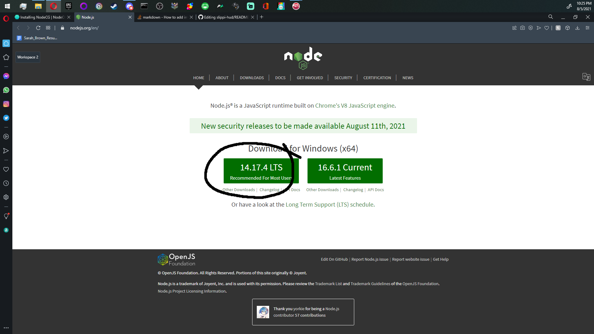
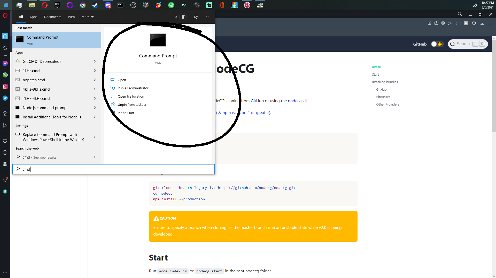
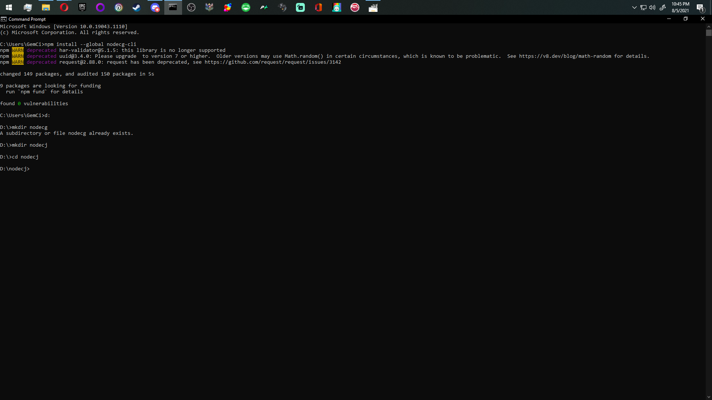
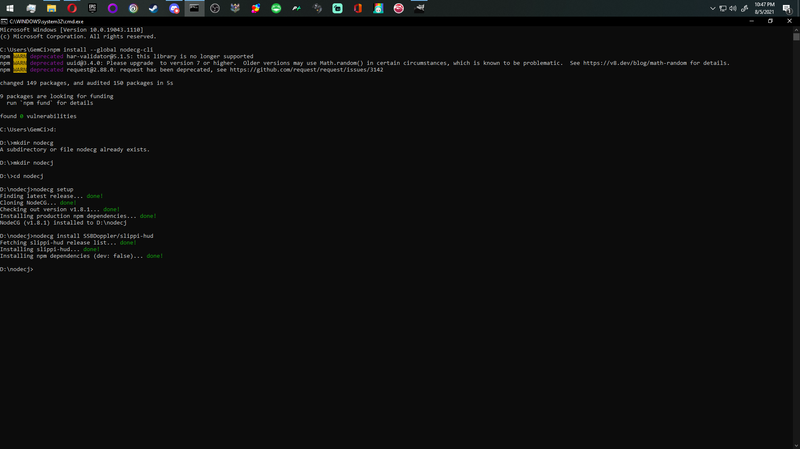
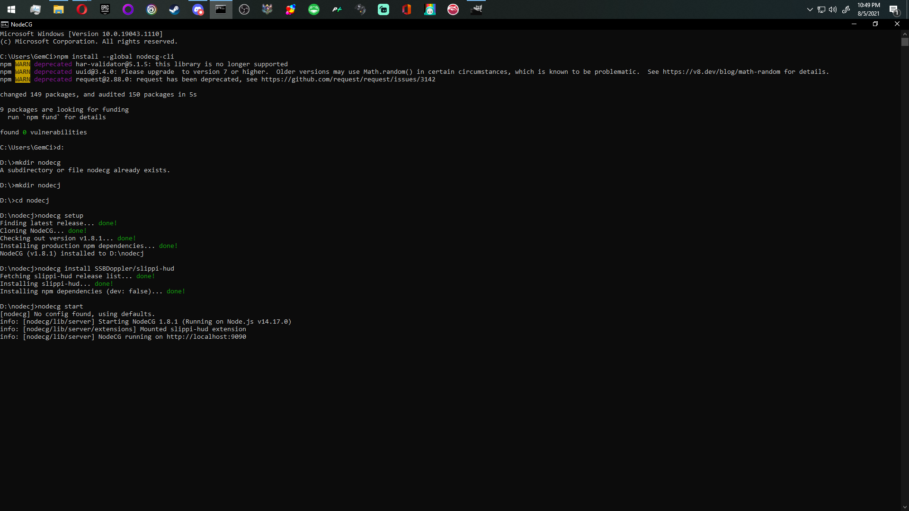
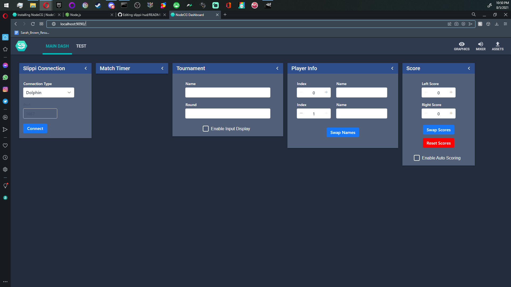

# Slippi-HUD
### A Slippi powered stream overlay

Welcome to Slippi-HUD, a nodecg package that can be used to power all kinds of slippi powered melee streams. You can create your own custom HUD, or an auto updating stream overlay.

## Installing SlippiHUD
To get started you should probably head over and [install node](https://nodejs.org)

Click that button and run the nodejs installer.

Next you'll want to install nodecg. I reccomend using command line for this part. Its the easiest option.

First press the windows button on your keyboard, then type cmd

You should see something like this

What I and the nodecg website recommend is using nodecg cli for the rest of the install, it's quick and basically painless.

First you'll type into the CMD
`npm install --global nodecg-cli`
Setting the global tag saves so much hassel.

Next you'll navigate to the folder you want to install nodecg in. I reccomend d: drive.

so you'll type
`d:`

Followed by a

`mkdir nodecg`

this will make the folder you install nodecg into

Next
`cd nodecg`
CMD is now in nodecg (I used nodecj because I already have nodecg and you can't make a folder that already exists with mkdir)

you'll now want to 
`nodecg setup`

followed by
`nodecg install SSBDoppler/slippi-hud`

And finally you'll want to start nodecg
`nodecg start`

You will have to navigate to the folder nodecg is setup in and type nodecg start into cmd everytime you want to start up SlippiHUD. ( you can create a bat file so you don't have to use cmd, I will detail that later)

## Accessing the dashboard

then open up your browser and head to [http://localhost:9090](http://localhost:9090) The default webpage.

it should look like this

## Finally how are you connecting to melee?

### In-Person
I reccomend the console mirroring option the slippi desktop program provides. (Version 1.6.10 works best for me)

Start the console mirror process.
I good tutorial if you don't know how to do this can be [found here](https://docs.google.com/document/d/1ezavBjqVGbVO8aqSa5EHfq7ZflrTCvezRYjOf51MOWg/edit)

Select Console Relay in the dashboard and enter the port the slippi desktop app gives you.

Press connect on the dashboard

### Slippi Online
Start up dolphin

Select dolphin in the drop-down 

press connect

## Getting it on stream
now that you're connected to melee, lets get this beautiful art on screen

First click graphics in the top right of your dashboard, then click copyurl next to SlippiHUD

And finally, got to OBS and create a browser source and paste that URL into it, be sure to set the width and height of the webpage to 1920x1080.

# Known Issues
None, lets go DragonBane0!!!!

# FAQ
### Why, just Why?
I'm a madman, obviously
### Hey, my font doesn't look right.
That's not a question, but you likely need to install the [Metropolis Light Font](https://www.1001fonts.com/metropolis-font.html)
### I don't like the way it looks
And? All you have to do is make your own html/css, the source code is right here.
### What are all the variables I can call?
See that folder labeled schemas? There be the awnsers you seek.
### Whats this coded in?
Python, Node, Javascript, and Lit as I understand.
# Credits
## Design Director
### Steven 'Doppler12' Knepper
#### Wrote the HUD css/html (that's my hackery), Designed the graphical elements, runs the git
SlippiHUD@gmail.com

## Lead Programmer
### Marwin 'dragonbane0' Misselhorn
#### wrote the whole backend that plugs into slippi
[website](https://misselhorn.xyz/)

[github](https://github.com/dragonbane0)

## Graphics
### Joel 'Potsy' Kaplan
##### Final HUD Art, the cool Logo
[Twitter](https://twitter.com/potsyjk)

### David Kimball
#### Melee HD Assets
[website](http://davidvkimball.com)
